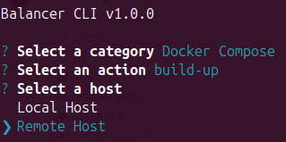

[< Back](../../README.md#getting-started)

# Build and run Balancer

Start the CLI:

```bash
npm start
```

Choose the category named **Docker Compose** and then trigger the `build-up` action on the **Remote Host**:



And that's it! You'll now be able to access your Balancer platform based on how you set up your remote host and domain.

**Tip:** even though Balancer makes use of the latest technologies and best practices to be able to withstand any kind of attack, I strongly recommend hiding its services behind a reverse proxy like [CloudFlare Tunnel](https://www.cloudflare.com/products/tunnel/) ([Integration guide](../cloudflare-tunnel/index.md)).