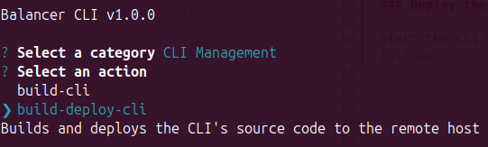

[< Back](../../README.md#getting-started)

# Deploy the CLI to the Remote Host

Start the CLI:

```bash
npm start
```

Choose the category named **CLI Management** and then trigger the `build-deploy-cli` action:

