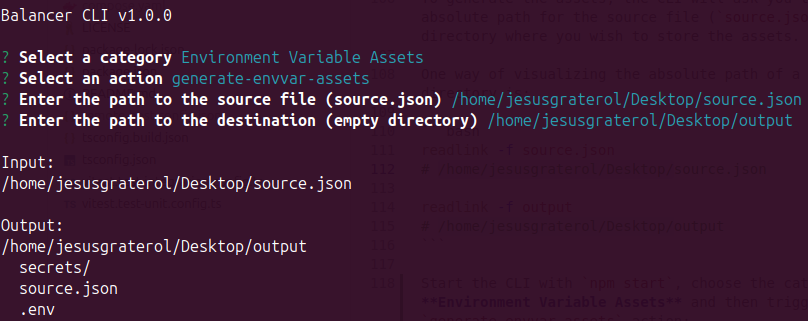
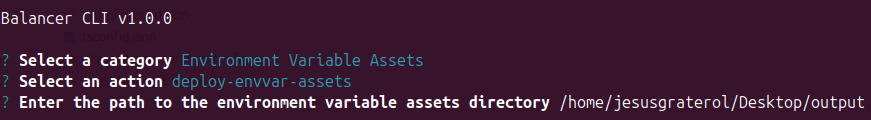

[< Back](../../README.md#getting-started)

# Environment Variables

The environment variables are a series of configuration and secret values used by Balancer to build and run its platform. The steps to generate and deploy the environment variables assets are:

1. Create and fill the source file (`source.json`)
2. Generate the environment variable assets
3. Deploy the assets to the remote host

And that's all! At this point, you'll be able to [build and run](../build-run-balancer/index.md) your Balancer Platform.

As mentioned earlier, several secret values need to be generated to fill the source file. This guide will make use of [`localkit`](https://github.com/jesusgraterol/localkit) to simplify the process.


<br/>

## Creating and filling the Source File

The source file (`source.json`) file used to generate the **environment variable assets** has the following schema:

```json
{
  "environment": {
    "NODE_ENV": "...",
    "GUI_URL": "...",
    "POSTGRES_HOST": "...",
    "POSTGRES_USER": "...",
    "POSTGRES_DB": "...",
    "POSTGRES_PASSWORD_FILE": "...",
    "ROOT_ACCOUNT": {
      "uid": "...",
      "nickname": "...",
      "password": "...",
      "otpSecret": "..."
    },
    "TELEGRAM": {
      "token": "...",
      "chatID": 0
    },
    "ALTCHA_SECRET": "...",
    "JWT_SECRET": {
      "refresh": "...",
      "access": "..."
    },
    "COOKIE_SECRET": "...",
    "EXCHANGE_CONFIGURATION": {
      "baseAsset": "...",
      "quoteAsset": "...",
      "window": "...",
      "liquidity": "...",
      "coins": "...",
      "trading": "..."
    },
    "EXCHANGE_CREDENTIALS": {
      "binance": {
        "key": "...",
        "secret": "..."
      },
      "bitfinex": {
        "key": "...",
        "secret": "..."
      },
      "kraken": {
        "key": "...",
        "secret": "..."
      }
    },
    "TUNNEL_TOKEN": "..."
  },
  "secrets": [
    "POSTGRES_PASSWORD_FILE",
    "ROOT_ACCOUNT",
    "TELEGRAM",
    "ALTCHA_SECRET",
    "JWT_SECRET",
    "COOKIE_SECRET",
    "EXCHANGE_CREDENTIALS"
  ]
}
```

To get started, create the `source.json` file and paste the template from above. The data will be entered under the `environment` property. Make sure to leave the `secrets` property untouched as Balancer makes use of [Docker Compose Secrets](https://docs.docker.com/compose/use-secrets/) to avoid putting sensitive data in the Operating System's environment variables for [security reasons](https://blog.diogomonica.com//2017/03/27/why-you-shouldnt-use-env-variables-for-secret-data/).


### `NODE_ENV`

The environment that will be used by Node.js processes to build and run the platform.

Accepted values are: `development` | `production`. If you're not a Balancer developer, set `production` on this field.

```json
{
  "NODE_ENV": "production",
}
```

### `GUI_URL`

The URL that will be used to access your Balancer GUI. If you're a Balancer developer, set `"http://localhost:5173"` on this field. Otherwise, set your URL.

```json
{
  "GUI_URL": "https://balancer.jesusgraterol.dev",
}
```

### `POSTGRES_*`

The configuration object that will be used for the PostgreSQL service.

To generate the password, start `localkit` and generate a random password of at least ~500 characters. 

**`POSTGRES_PASSWORD_FILE` sample:** `"Y@|hmndw02j7JSx9q?t...#o4nf[:9yduNTX3Ob9"`

```json
{
  "POSTGRES_HOST": "postgres",
  "POSTGRES_USER": "postgres",
  "POSTGRES_DB": "postgres",
  "POSTGRES_PASSWORD_FILE": "<YOUR_PASSWORD>",
}
```

### `ROOT_ACCOUNT`

The details that will be used to create your `root` account (user with the highest authority) and can also be generated via `localkit`.

- The **`uid`** must be a [Universally unique identifier v4](https://en.wikipedia.org/wiki/Universally_unique_identifier) (e.g. `"4952cdd9-314b-4dd2-9d7e-91b71fc99fa9"`)
- The **`password`** must be a random string of at least ~50 characters (e.g. `"v(s]lynV...;?6za#yV.,ILc"`)
- The **`otpSecret`** must be a valid One-Time Password secret (e.g. `"EJORCBYBHIMU2JKC"`)

```json
{
  "ROOT_ACCOUNT": {
    "uid": "<YOUR_UID>",
    "nickname": "root",
    "password": "<YOUR_UID>",
    "otpSecret": "<YOUR_OTP_SECRET>",
  },
}
```

### `TELEGRAM`

Balancer has an internal notifications system that can be upgraded to use Telegram so you're notified whenever an event takes place.

The guide to integrate Telegram can be found [here](../telegram/index.md). 

- **`token` sample:** `"5120556612:XLZ1jygn-7PcQcSaTwH8LjBxF4KMfWXPAzA"`
- **`chatID` sample:** `-4102361445`

```json
{
  "TELEGRAM": {
    "token": "<YOUR_TOKEN>",
    "chatID": <YOUR_CHAT_ID>
  },
}
```

If you do not wish to go through with the integration, the environment variable still needs to be set as follows:

```json
{
  "TELEGRAM": {
    "token": "",
    "chatID": 0
  },
}
```


<br/><br/>

## Generating the Environment Variable Assets

To generate the assets, the CLI will ask you to enter the absolute path for the source file (`source.json`) and the directory where you wish to store the assets.

One way of visualizing the absolute path of a file or directory is:

```bash
readlink -f source.json 
# /home/jesusgraterol/Desktop/source.json

readlink -f output
# /home/jesusgraterol/Desktop/output
```

Start the CLI with `npm start`, choose the category named **Environment Variable Assets** and then trigger the `generate-envvar-assets` action:




<br/><br/>

## Deploying the assets to the Remote Host

Once you have generated the environment variable assets and have stored them securely, you can proceed to deploy them to the remote host by triggering the `deploy-envvar-assets` action:

